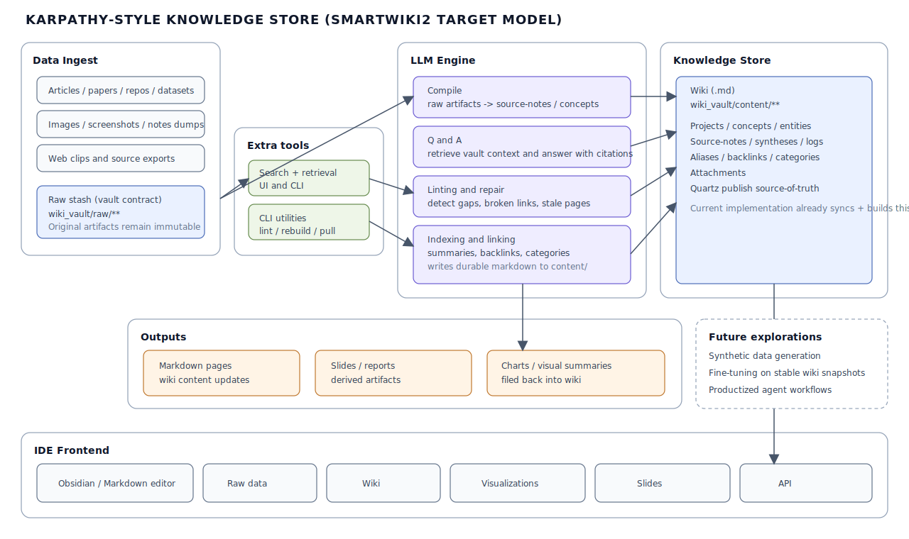
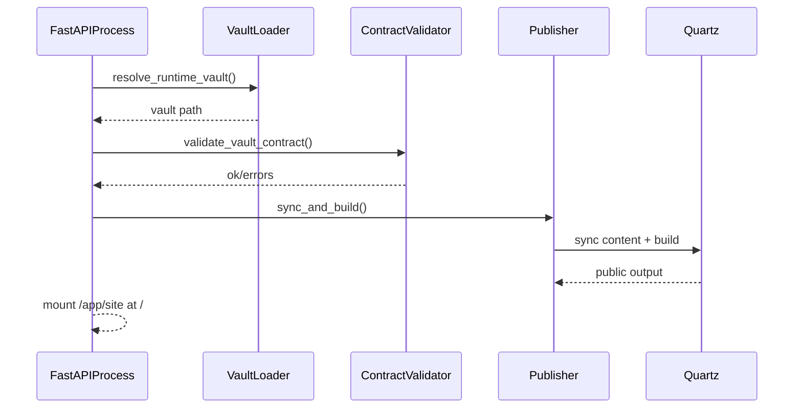

# SmartWiki2 Architecture

## 1) Purpose and Scope

SmartWiki2 is the **control program** for a Karpathy-style wiki.

It is responsible for:
- runtime vault instantiation
- vault contract validation
- ingestion/query/lint/rebuild API orchestration
- OpenRouter-backed LLM calls
- publishing wiki content through Quartz
- serving API and published site from the same runtime container

SmartWiki2 is **not** the data repository. Wiki content remains in an independent `wiki_vault` repo.

## 2) Core Architectural Invariants

1. **Program/data separation is strict**
   - Control code lives in this repository.
   - Wiki content lives in an external `wiki_vault` repository instantiated at runtime.
   - No submodules, subtree, vendoring, or monorepo coupling.

2. **Vault contract drives behavior**
   - `wiki_vault` must satisfy required folder and file structure.
   - System startup fails fast on contract violations.

3. **Publish source of truth**
   - `wiki_vault/content` is the only publishable source.
   - Publish pipeline is sync -> build -> serve.

4. **Runtime determinism**
   - Structural LLM operations default to low temperature.
   - Retry/backoff is used for transient model errors.

5. **Container co-hosting**
   - Published site and API are served by the same containerized service.

## 3) High-Level Topology

```mermaid
flowchart TD
  apiClient[UserOrAutomation] --> fastapi[FastAPI app]
  fastapi --> vaultLoader[Vault Loader]
  vaultLoader --> vaultFS[wiki_vault filesystem]
  fastapi --> validator[Vault Contract Validator]
  validator --> vaultFS
  fastapi --> ingestSvc[Ingest Service]
  fastapi --> lintSvc[Lint Service]
  fastapi --> querySvc[Query Service]
  querySvc --> openrouter[OpenRouter via OpenAI SDK]
  fastapi --> publishSvc[Publisher Service]
  publishSvc --> quartzSync[Sync wiki_vault/content]
  quartzSync --> quartzWS[publisher/quartz/content]
  publishSvc --> quartzBuild[Quartz Build]
  quartzBuild --> siteDir[/app/site]
  fastapi --> siteDir
```

### SVG: Component Topology

<svg viewBox="0 0 980 420" width="100%" xmlns="http://www.w3.org/2000/svg" role="img" aria-label="SmartWiki2 component topology">
  <defs>
    <marker id="arrowA" markerWidth="10" markerHeight="10" refX="9" refY="5" orient="auto">
      <path d="M0,0 L10,5 L0,10 z" fill="#4b5563" />
    </marker>
    <style>
      .box { fill: #f8fafc; stroke: #334155; stroke-width: 1.4; rx: 8; }
      .title { font: 600 13px Arial, sans-serif; fill: #0f172a; }
      .txt { font: 12px Arial, sans-serif; fill: #1f2937; }
      .line { stroke: #4b5563; stroke-width: 1.4; marker-end: url(#arrowA); fill: none; }
      .group { fill: #eef2ff; stroke: #6366f1; stroke-dasharray: 5 4; rx: 10; }
      .groupTitle { font: 600 12px Arial, sans-serif; fill: #3730a3; }
    </style>
  </defs>

  <rect class="group" x="20" y="20" width="560" height="380" />
  <text class="groupTitle" x="30" y="40">SmartWiki2 Control Program</text>

  <rect class="box" x="50" y="70" width="160" height="52" />
  <text class="title" x="72" y="101">FastAPI App</text>

  <rect class="box" x="260" y="60" width="180" height="52" />
  <text class="title" x="280" y="91">Vault Loader + Validator</text>

  <rect class="box" x="260" y="140" width="180" height="52" />
  <text class="title" x="288" y="171">API Services</text>

  <rect class="box" x="260" y="220" width="180" height="52" />
  <text class="title" x="288" y="251">Publisher Service</text>

  <rect class="box" x="260" y="300" width="180" height="52" />
  <text class="title" x="292" y="331">OpenRouter Client</text>

  <rect class="box" x="620" y="60" width="150" height="52" />
  <text class="title" x="650" y="91">wiki_vault FS</text>

  <rect class="box" x="620" y="160" width="150" height="52" />
  <text class="title" x="652" y="191">Quartz WS</text>

  <rect class="box" x="620" y="260" width="150" height="52" />
  <text class="title" x="642" y="291">Site Output</text>

  <rect class="box" x="800" y="300" width="150" height="52" />
  <text class="title" x="826" y="331">OpenRouter API</text>

  <line class="line" x1="210" y1="96" x2="260" y2="86" />
  <line class="line" x1="210" y1="100" x2="260" y2="166" />
  <line class="line" x1="210" y1="106" x2="260" y2="246" />
  <line class="line" x1="210" y1="112" x2="260" y2="326" />

  <line class="line" x1="440" y1="86" x2="620" y2="86" />
  <line class="line" x1="440" y1="246" x2="620" y2="186" />
  <line class="line" x1="440" y1="246" x2="620" y2="286" />
  <line class="line" x1="440" y1="326" x2="800" y2="326" />

  <line class="line" x1="620" y1="86" x2="440" y2="166" />
  <line class="line" x1="620" y1="286" x2="210" y2="120" />

  <text class="txt" x="54" y="142">/api/* + "/" static site</text>
  <text class="txt" x="620" y="136">contract-bound data repo</text>
  <text class="txt" x="620" y="236">content sync + build</text>
</svg>

## 3A) Karpathy Knowledge Store Model (Target)



### SVG: LLM authoring lifecycle


This model extends the baseline architecture with explicit capability bands:

1. **Data ingest**
   - heterogeneous source artifacts (articles, papers, repos, datasets, images, clips)
   - normalized into `wiki_vault/raw/**` and optional extraction outputs

2. **LLM engine**
   - compile raw materials into durable pages
   - answer questions from vault context
   - lint/repair wiki quality
   - maintain indexes, summaries, and links

3. **Knowledge store**
   - durable markdown graph in `wiki_vault/content/**`
   - canonical page classes, frontmatter contract, and attachments
   - single publish source for Quartz

4. **Outputs and loopback**
   - markdown pages (current primary output)
   - optional slides/charts/reports generated from wiki state
   - loopback path that files derived artifacts back into wiki content

5. **Frontend and operations**
   - editor-first workflow (Obsidian/Markdown tools)
   - API/CLI workflows for ingest, lint, rebuild, query

### Capability mapping: current vs target

| Capability from model | Current baseline in repo | Planned expansion |
|---|---|---|
| Raw ingest registry | `POST /api/ingest` + `POST /api/ingest/scan` track files in `manifests/ingest.sqlite` and `sources.jsonl` | Add richer enrichment and job orchestration |
| Compile raw -> wiki | manual authoring in `content/**` | LLM-assisted authoring/upsert passes |
| Q&A over knowledge store | `POST /api/query` with OpenRouter | Better retrieval ranking + uncertainty handling |
| Linting and health checks | `/api/lint` rules + link checks | semantic duplicate/orphan repair and guided fixes |
| Indexing and backlinks | manual page maintenance | automated index/backlink maintenance |
| Output loopback (slides/charts) | not yet | add exporters and write-back workflow |

## 4) Repository Layout and Responsibilities

### `app/`
- `main.py`
  - FastAPI app construction
  - startup lifecycle (instantiate vault, validate, initial publish)
  - route registration
  - static mount for site serving
- `config.py`
  - typed environment-backed runtime settings
  - path resolution for vault, Quartz workspace, and site output
- `api/`
  - `health.py`: basic service health
  - `ingest.py`: single-file and scan ingestion, then rebuild trigger
  - `query.py`: retrieval context assembly + OpenRouter call
  - `lint.py`: lint pass over vault
  - `rebuild.py`: explicit publish rebuild endpoint
- `llm/`
  - `openrouter_client.py`: OpenAI SDK client pointing to OpenRouter
  - `prompts.py`, `schemas.py`: prompt/schema helpers
- `services/`
  - `vault_loader.py`: runtime vault resolution + contract validation
  - `publisher.py`: content sync, Quartz build, dev watcher
  - `ingester.py`: stable source IDs + manifest/log writes
  - `raw_ingestor.py`: raw scan, SQLite tracking, extraction, source-note authoring
  - `linker.py`: wikilink extraction and missing link detection
  - `linter.py`: vault lint checks
  - `classifier.py`, `synthesizer.py`: LLM service wrappers
  - `git_loader.py`: clone/fetch helpers for vault repo
- `models/`
  - `vault_contract.py`: required paths and validation model
  - other typed models/enums
- `util/`
  - filesystem, markdown link parsing, slugs, timestamps

### `publisher/`
- `sync_to_quartz.py`
  - copies `wiki_vault/content` into `publisher/quartz/content`
- `quartz/`
  - Quartz workspace and build script
  - build output staged via `public/`

### `docker/`
- `Dockerfile`
  - Python + Node runtime, app copy, Quartz dependency install
- `entrypoint.sh`
  - startup ordering contract:
    1) prepare vault path
    2) resolve/instantiate vault
    3) validate vault
    4) sync/build site
    5) start FastAPI

### `scripts/`
- bootstrap/clone/rebuild/lint helper scripts and dev shell

### `tests/`
- contract validation tests
- link resolution tests
- publish sync tests
- instantiation mode tests

## 5) Runtime Configuration Model

Configuration is environment-driven through `app/config.py`.

### OpenRouter
- `OPENROUTER_API_KEY`
- `OPENROUTER_MODEL`
- `OPENROUTER_BASE_URL` (default `https://openrouter.ai/api/v1`)
- `OPENROUTER_HTTP_REFERER`
- `OPENROUTER_TITLE`

### Vault and mode
- `WIKI_VAULT_PATH` (optional explicit override)
- `WIKI_VAULT_GIT_URL` (used for runtime clone)
- `SMARTWIKI_ENV` (`dev` enables content watcher)
- `SMARTWIKI_QUARTZ_DIR`
- `SMARTWIKI_SITE_DIR`

## 6) Vault Instantiation and Validation

### Container resolution order (contract)
1. If `/app/wiki_vault/.git` exists, use `/app/wiki_vault`.
2. Else if `/app/wiki_vault` exists and is non-empty, use it.
3. Else if `WIKI_VAULT_GIT_URL` is set, clone to `/app/wiki_vault`.
4. Else fail with explicit error.

### SVG: Vault Instantiation Decision Flow

<svg viewBox="0 0 980 320" width="100%" xmlns="http://www.w3.org/2000/svg" role="img" aria-label="Vault instantiation decision flow">
  <defs>
    <marker id="arrowB" markerWidth="10" markerHeight="10" refX="9" refY="5" orient="auto">
      <path d="M0,0 L10,5 L0,10 z" fill="#374151" />
    </marker>
    <style>
      .d { fill: #ffffff; stroke: #1f2937; stroke-width: 1.3; }
      .dt { font: 600 12px Arial, sans-serif; fill: #111827; }
      .a { stroke: #374151; stroke-width: 1.3; marker-end: url(#arrowB); fill: none; }
      .lbl { font: 12px Arial, sans-serif; fill: #374151; }
    </style>
  </defs>

  <rect class="d" x="30" y="120" width="140" height="50" rx="8" />
  <text class="dt" x="49" y="150">Start /app/wiki_vault</text>

  <polygon class="d" points="250,90 340,145 250,200 160,145" />
  <text class="dt" x="210" y="149">.git exists?</text>

  <polygon class="d" points="470,90 560,145 470,200 380,145" />
  <text class="dt" x="405" y="149">non-empty dir?</text>

  <polygon class="d" points="690,90 780,145 690,200 600,145" />
  <text class="dt" x="620" y="149">WIKI_VAULT_GIT_URL?</text>

  <rect class="d" x="840" y="60" width="110" height="42" rx="8" />
  <text class="dt" x="858" y="86">Clone vault</text>

  <rect class="d" x="840" y="130" width="110" height="42" rx="8" />
  <text class="dt" x="866" y="156">Use vault</text>

  <rect class="d" x="840" y="200" width="110" height="42" rx="8" />
  <text class="dt" x="864" y="226">Fail clear</text>

  <path class="a" d="M170 145 H160" />
  <path class="a" d="M340 145 H380" />
  <path class="a" d="M560 145 H600" />
  <path class="a" d="M780 145 H840" />

  <path class="a" d="M250 200 C250 240, 870 240, 895 172" />
  <path class="a" d="M470 200 C470 230, 850 210, 895 172" />
  <path class="a" d="M690 200 C690 240, 850 250, 895 222" />
  <path class="a" d="M895 102 V130" />

  <text class="lbl" x="286" y="136">yes</text>
  <text class="lbl" x="350" y="116">no</text>
  <text class="lbl" x="506" y="136">yes</text>
  <text class="lbl" x="570" y="116">no</text>
  <text class="lbl" x="726" y="136">yes</text>
  <text class="lbl" x="790" y="116">no</text>
</svg>

### Local behavior
- prefer `WIKI_VAULT_PATH` if configured and exists
- else use `./wiki_vault` if present
- else clone from `WIKI_VAULT_GIT_URL` if provided
- else fail with clear guidance

### Validation behavior
- required directories/files are declared in `app/models/vault_contract.py`
- startup validation returns structured errors
- failing validation aborts startup, preventing partial/invalid operation

## 7) Request and Lifecycle Flows

### Startup flow



### SVG: Startup and Publish Pipeline

<svg viewBox="0 0 980 260" width="100%" xmlns="http://www.w3.org/2000/svg" role="img" aria-label="Startup and publish pipeline">
  <defs>
    <marker id="arrowC" markerWidth="10" markerHeight="10" refX="9" refY="5" orient="auto">
      <path d="M0,0 L10,5 L0,10 z" fill="#334155" />
    </marker>
    <style>
      .s { fill: #f8fafc; stroke: #334155; stroke-width: 1.3; rx: 8; }
      .st { font: 600 12px Arial, sans-serif; fill: #0f172a; }
      .sl { stroke: #334155; stroke-width: 1.3; marker-end: url(#arrowC); fill: none; }
      .n { font: 11px Arial, sans-serif; fill: #334155; }
    </style>
  </defs>

  <rect class="s" x="20" y="100" width="120" height="44" />
  <text class="st" x="46" y="127">FastAPI boot</text>

  <rect class="s" x="170" y="100" width="150" height="44" />
  <text class="st" x="188" y="127">Resolve vault path</text>

  <rect class="s" x="350" y="100" width="150" height="44" />
  <text class="st" x="362" y="127">Validate contract</text>

  <rect class="s" x="530" y="100" width="150" height="44" />
  <text class="st" x="547" y="127">Sync to Quartz</text>

  <rect class="s" x="710" y="100" width="120" height="44" />
  <text class="st" x="735" y="127">Build site</text>

  <rect class="s" x="860" y="100" width="100" height="44" />
  <text class="st" x="874" y="127">Serve /</text>

  <line class="sl" x1="140" y1="122" x2="170" y2="122" />
  <line class="sl" x1="320" y1="122" x2="350" y2="122" />
  <line class="sl" x1="500" y1="122" x2="530" y2="122" />
  <line class="sl" x1="680" y1="122" x2="710" y2="122" />
  <line class="sl" x1="830" y1="122" x2="860" y2="122" />

  <text class="n" x="538" y="165">wiki_vault/content -> publisher/quartz/content</text>
  <text class="n" x="720" y="182">publisher/quartz/public -> /app/site</text>
</svg>

### Ingest flow
1. `POST /api/ingest` receives source path.
2. Validates source file exists.
3. Tracks file fingerprint metadata in vault-local SQLite (`manifests/ingest.sqlite`).
4. Extracts text to `exports/transcripts/<source_id>.md` when supported.
5. Creates or updates a `content/source-notes/*.md` page with required frontmatter.
6. Registers source in `manifests/sources.jsonl` and appends log entry to `content/logs/log.md`.
7. Triggers publish sync/build.

### Ingest scan flow
1. `POST /api/ingest/scan` walks `wiki_vault/raw/**`.
2. New or changed files are ingested; unchanged files are skipped.
3. Rebuild runs only when at least one file changed.

### Query flow
1. `POST /api/query` receives question.
2. Loads selected markdown pages from vault content as retrieval context.
3. Calls OpenRouter-backed model (if key configured).
4. Returns answer plus citations.

### Lint flow
1. `GET /api/lint` runs lint pass over content pages.
2. Includes frontmatter checks, missing wikilinks, stale-page heuristics.

### Rebuild flow
1. `POST /api/rebuild` forces sync/build pipeline.

## 8) Publishing Architecture

Publishing is intentionally filesystem-based:
- Source: `wiki_vault/content`
- Staging: `publisher/quartz/content`
- Build output: `publisher/quartz/public`
- Served output: `/app/site`

In dev mode, a file watcher monitors `wiki_vault/content` and performs rebuilds with simple debounce.

## 9) API Surface

- `GET /api/health`
- `POST /api/ingest`
- `POST /api/ingest/scan`
- `POST /api/query`
- `GET /api/lint`
- `POST /api/rebuild`
- `GET /` (published static wiki)

## 10) Security and Operational Model

1. **Secrets**
   - API keys are env vars only.
   - No secrets committed into repo or image layers.

2. **Git and SSH**
   - Vault may be cloned via SSH in runtime.
   - SSH agent forwarding / deploy key strategy is expected externally.
   - No private keys baked in image.

3. **Data ownership**
   - Vault git history remains independent from control repo history.
   - Vault commit/push operations are explicit operator actions.

4. **Failure strategy**
   - Contract mismatch -> fail startup early.
   - Initial Quartz build errors are logged; service still starts with placeholder page.

## 11) Extensibility Roadmap

The architecture is designed for progressive hardening:

1. **Ingestion pipeline deepening**
   - richer extraction/OCR adapters and quality scoring
   - queue-based job orchestration and retry controls

2. **Query quality**
   - better retrieval ranking and synthesis preference
   - citation quality and uncertainty scoring

3. **Link/lint sophistication**
   - duplicate detection via alias graph
   - orphan scoring and stale policy tuning

4. **Publisher improvements**
   - full Quartz upstream integration and richer theme config
   - incremental build strategy

5. **Operational maturity**
   - health/readiness probes
   - structured logs/metrics/tracing
   - background queue for expensive ingestion tasks

## 12) Decision Log (Current Baseline)

1. **Filesystem contract first**
   - chose explicit path-based contract over tight data-model coupling.

2. **Single-process co-hosting**
   - FastAPI serves API and site for deployment simplicity.

3. **Synchronous rebuild triggers**
   - selected simple correctness-first rebuild behavior for initial baseline.

4. **Config-by-env**
   - used typed settings to keep runtime deterministic and deployment-agnostic.

---

For operator usage and startup instructions, see `README.md`.
